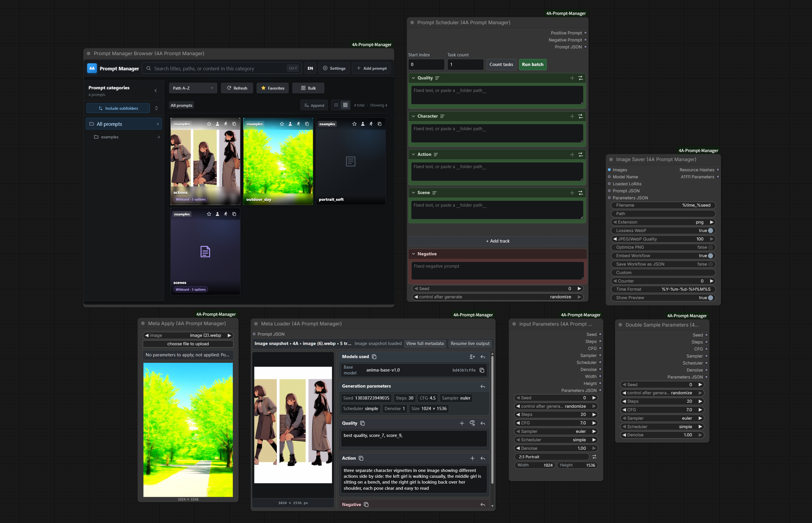
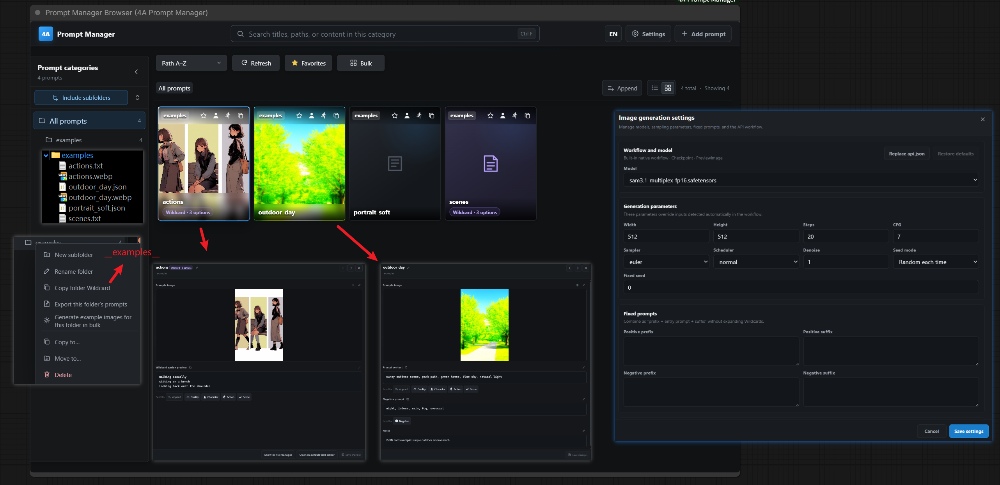
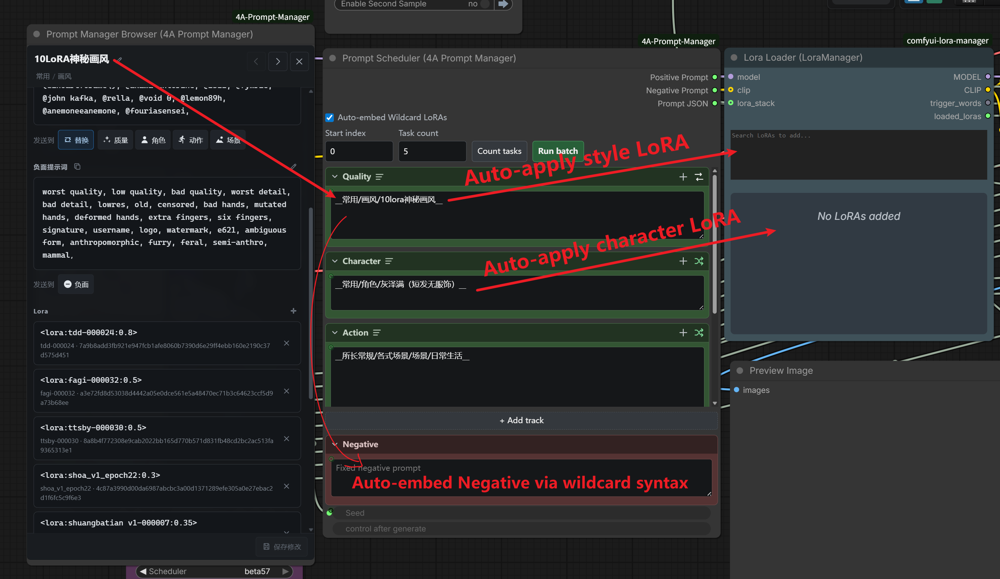
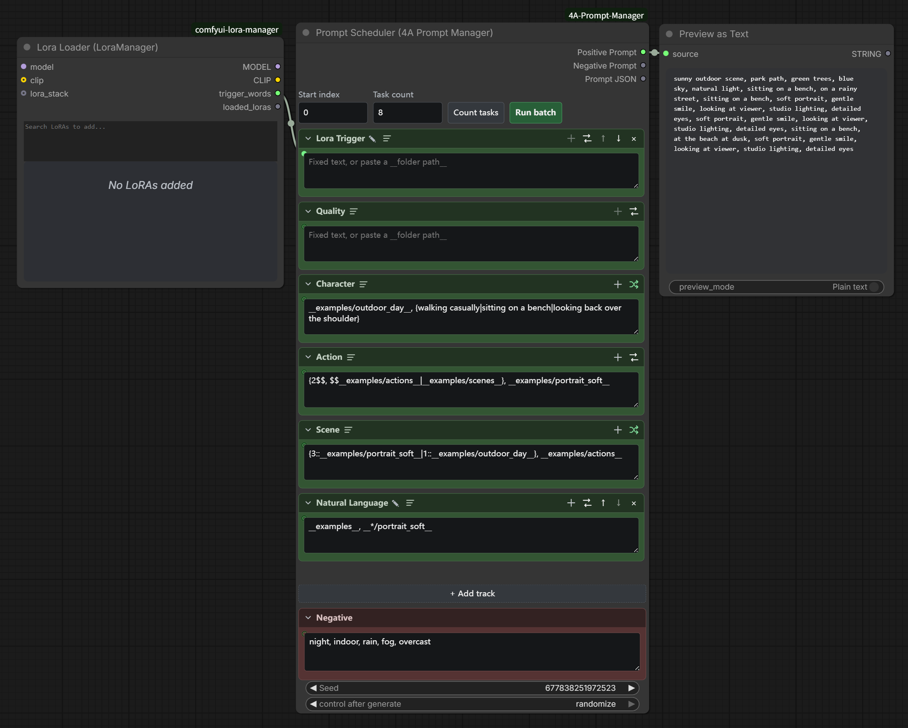
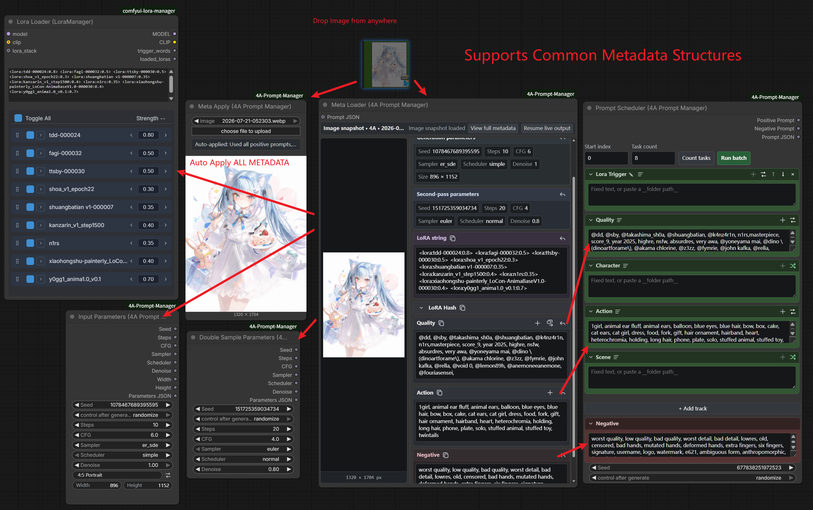
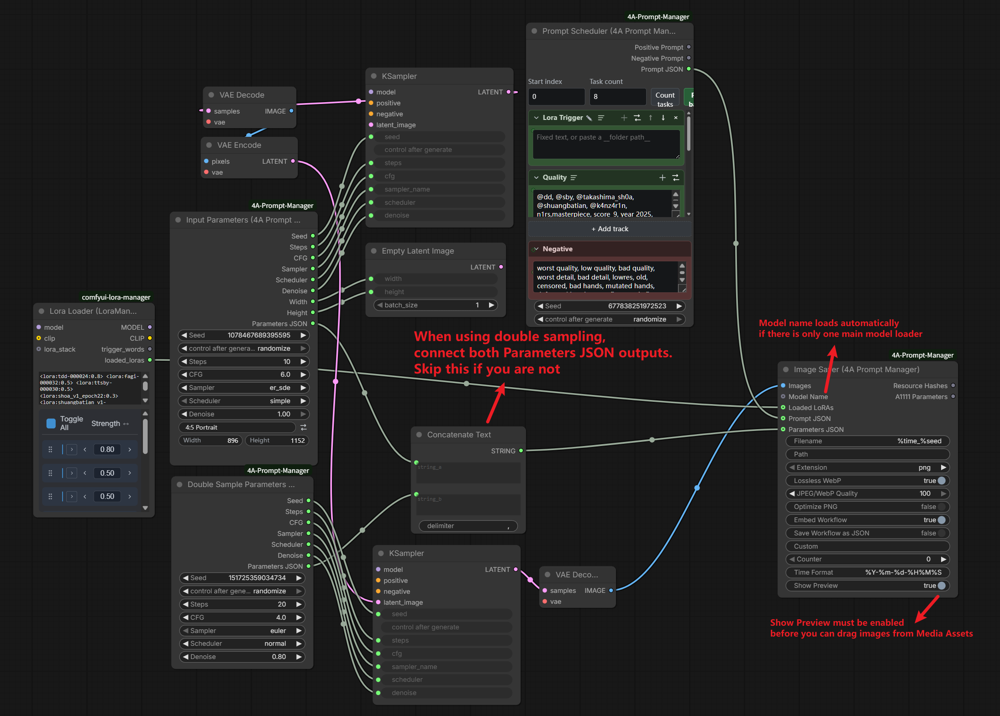

# ComfyUI-4A-Prompt-Manager

[中文说明](README.zh-CN.md)

Chinese video guide (Bilibili): https://www.bilibili.com/video/BV1DWKv6NE6t  
Update #1 (Bilibili): https://www.bilibili.com/video/BV1Ccg86nErh

Folder-backed prompt library and scheduler for ComfyUI: browse/edit wildcards and JSON cards (LoRAs + sparse generation settings), assemble multi-track prompts, auto-apply settings on Wildcard batch runs, reuse image metadata, and save generations with portable parameters.

**Current release: 1.2.0** — card generation settings, Bypass Switch for second pass, Wildcard auto-apply for LoRAs/models/params, and batch grouping for the same LoRA stack.



## Highlights

### Prompt Manager frontend

A full, easy-to-use library UI. Prompts live as a normal folder tree (JSON cards + TXT wildcards), so you can back up or share by copying folders; import/export freely; generate preview images for cards (uses a built-in API workflow, or replace it with your own `api.json`). The last folder and sidebar expansion are remembered across reloads. After a library refresh you can align card model names to local files by hash.



### JSON card LoRAs / generation settings + wildcard auto-apply

JSON cards can sparsely store LoRAs, models, sampler settings (including seed/size), and double-sample settings. Empty fields are omitted from JSON; presence of a double-sample block means second pass ON (no separate enable flag). When Scheduler tracks resolve those cards via wildcard syntax, enable **Auto-embed Wildcard LoRAs** and/or **Auto-apply models / inference parameters** to write matching nodes before queueing, then restore the canvas baseline (seed is not restored). With auto-embed on, **Group same models / LoRAs** queues jobs that share the same stack together to reduce reloads. Conflict rules: LoRAs stack (skip same name); everything else is first-wins per field. **Bypass Switch** follows whether the card has double-sample fields—wire the second-pass subgraph/parameters into it (one switch per workflow for now). Dropping an image when creating a card still reads prompts only by default; use **Load generation settings from image** (with overwrite confirm) for models/params/size/LoRA. Detail view can also push models / LoRA / parameters into the canvas in one click.



### Multi-track Prompt Scheduler

Stack positives across tracks with random / sequence / shuffle, Impact-compatible wildcard parsing (`__key__`, `{a|b}`, weights, multi-select, folder and global name lookup), and optional STRING inputs wired into each track from the graph.



### Metadata reuse (Meta Loader & Meta Apply)

Read prompts and params from common image formats. Drop images from the Browser UI, outside the app, or ComfyUI assets; one click to reuse embedded prompts, sampler settings, and LoRA stacks (LoRA apply needs [Lora Manager](https://github.com/willmiao/ComfyUI-Lora-Manager)). Meta Apply has separate toggles for model, LoRA, inference parameters, and prompt. Applying parameters also syncs Bypass Switch from whether double-sample fields are present.



### Input Parameters & Image Saver

Simple wiring for sampler / resolution outputs; save PNG/JPEG/WebP with A1111-style metadata so your prompts and params stay portable and reusable (JPEG/WebP need `piexif`).



## Install

### ComfyUI-Manager (recommended)

Search for **4A Prompt Manager** / `ComfyUI-4A-Prompt-Manager` and install. Dependencies from `requirements.txt` / `install.py` are handled by Manager.

### Manual

```bash
cd ComfyUI/custom_nodes
git clone https://github.com/tsukino4a/ComfyUI-4A-Prompt-Manager.git ComfyUI-4A-Prompt-Manager
cd ComfyUI-4A-Prompt-Manager
python install.py
# or: pip install -r requirements.txt
```

Restart ComfyUI after install.

## Quick start

1. Open **Workflow → Browse Templates → ComfyUI-4A-Prompt-Manager** and try:
   - `01_single_sampler_workflow` — Input Parameters → KSampler → Image Saver
   - `02_double_sampler_workflow` — Double Sample Parameters + second pass
2. Open a **Prompt Manager Browser** node (or the top-menu browser). You should see shipped samples under `wildcards/examples/` (JSON cards + TXT wildcards).
3. To learn **batch import**, use [`examples/pm4a_examples_bundle.json`](examples/pm4a_examples_bundle.json) — the same `pm4a-prompt-bundle` shape produced by library export (mixed `json` + `txt` entries). Import it from the Browser import dialog; do not put this file inside `wildcards/` (it is not a single prompt card).

## Nodes

| Node | Role |
|------|------|
| Prompt Manager Browser | Full library UI in a node |
| Prompt Scheduler | Build positive/negative strings from tracks |
| Meta Loader (Prompt Display) | Inspect image metadata cards; apply LoRA text when Lora Manager is present |
| Meta Apply | Auto-apply image metadata to linked targets (including LoRA via Lora Manager) |
| Input Parameters | Seed / steps / cfg / sampler / size + JSON |
| Double Sample Parameters | Second-pass sampler JSON |
| Bypass Switch | Wire-controlled Bypass/Always for connected nodes; ON when the card has double-sample fields |
| Image Saver | Save images with hashes & A1111 params |

## Example workflows & library samples

| Path | Purpose |
|------|---------|
| [`example_workflows/`](example_workflows/) | UI templates for **Browse Templates** (+ `.png` previews) |
| [`wildcards/examples/`](wildcards/examples/) | Shipped prompt samples (loaded by the library) |
| [`examples/pm4a_examples_bundle.json`](examples/pm4a_examples_bundle.json) | Export/import demo bundle |
| [`workflows/default_api.json`](workflows/default_api.json) | Built-in UNet API graph for in-browser preview generation (replaceable) |

Select models in template workflows before running if loaders are empty or point to names you do not have locally.

## Dependencies

- **Required extra:** [`piexif`](https://pypi.org/project/piexif/) (`>=1.1.3`) for JPEG/WebP EXIF when using Image Saver / preview EXIF
- Pillow, NumPy, aiohttp are provided by ComfyUI

Without `piexif`, PNG save still works; JPEG/WebP metadata write will error (preview WebP may skip EXIF silently).

## License

This project is released under the [MIT License](LICENSE).

Image Saver adaptations from [ComfyUI-Image-Saver](https://github.com/alexopus/ComfyUI-Image-Saver) are documented in [`THIRD_PARTY_NOTICES.md`](THIRD_PARTY_NOTICES.md).
